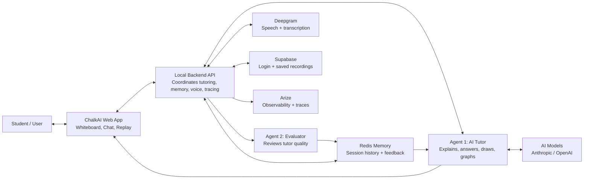

# ChalkAI Architecture

ChalkAI has two AI roles: Agent 1 tutors the student, while Agent 2 reviews how well Agent 1 taught. Agent 2's feedback is saved in Redis memory, so future tutoring responses can improve based on past sessions.

Most product paths are bidirectional because the app sends user/session data to the backend and receives streamed responses, recordings, transcripts, or saved state back. Arize is mostly one-way: the backend exports traces so the team can inspect what the AI is doing.
